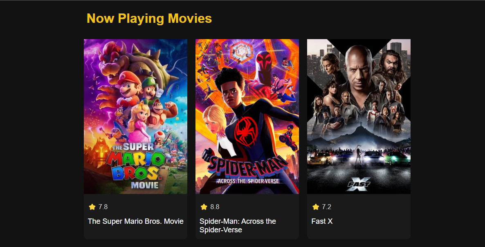
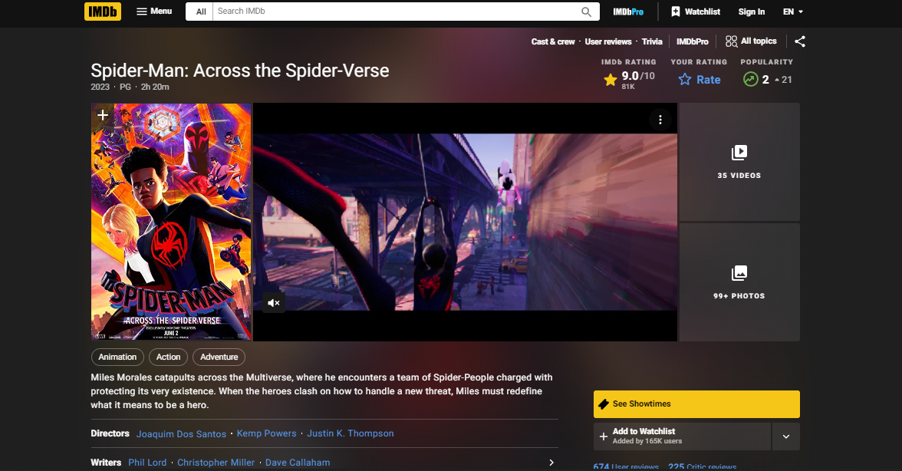

# IMDb Movie Search

IMDb Movie Search is a web application that allows users to search for movies and view information about them from IMDb. 
It utilizes the TMDB API (The Movie Database API) to fetch movie data and provides an intuitive interface for users to explore movies.
Visit : https://sukumarmali.github.io/IMDb/

## Technologies Used

- HTML
- CSS
- Javascript
- TMDB API

## Features

- Search for movies by title
- Display movie details including title, rating, and poster image
- Direct link to the corresponding IMDb page for more information
- Responsive layout for optimal viewing on different devices

## Usage

1. Clone the repository: https://github.com/sukumarmali/IMDb.git
2. Open the `index.html` file in a web browser.
3. Use the search bar to enter a movie title and press Enter or click the search button.
4. View the search results displayed as movie cards.
5. Click on a movie card to visit the corresponding IMDb page for more details.

## Screenshots

IMDb movie search - Home Page 

Dedicated page of Movie - Movie Information page.

## Acknowledgements

- This project utilizes the TMDB API. For more information, visit [TMDB API Documentation](https://developers.themoviedb.org/3).
